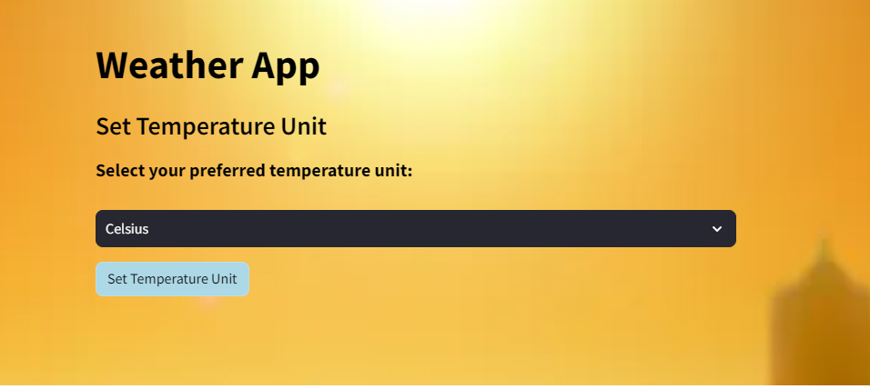
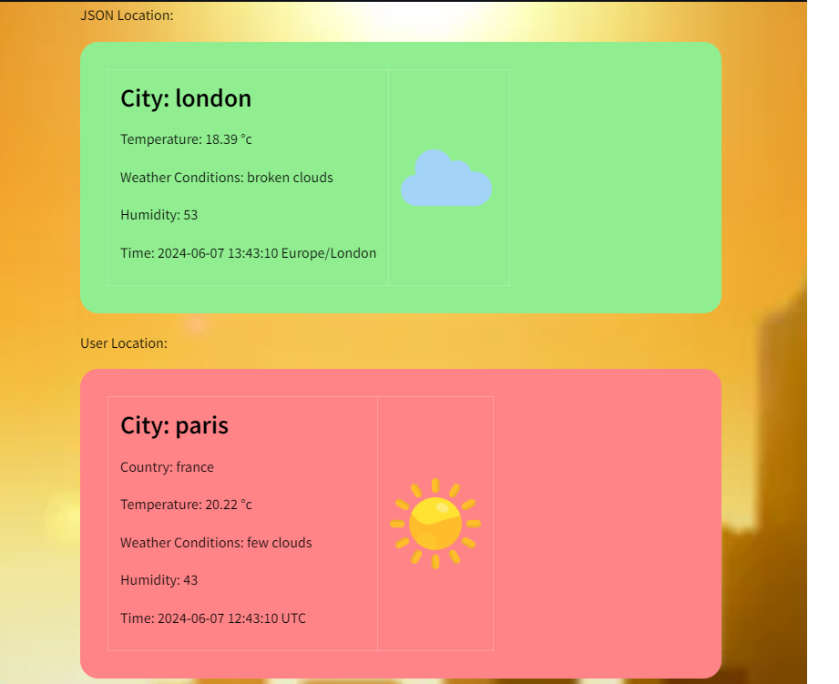
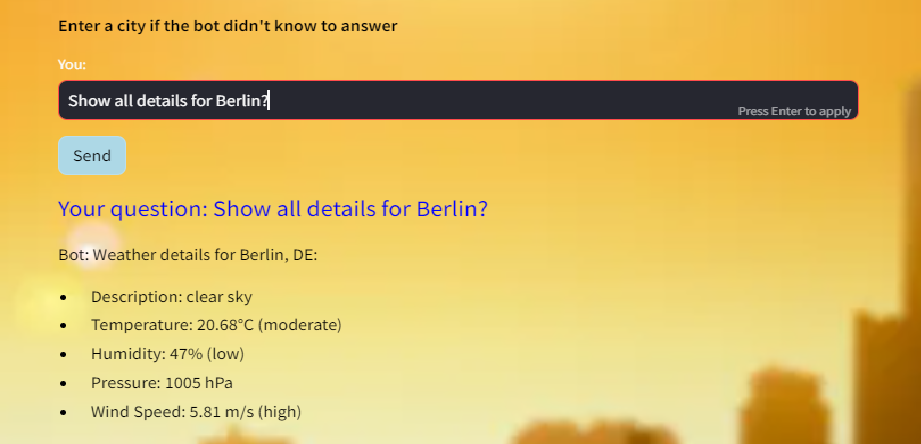
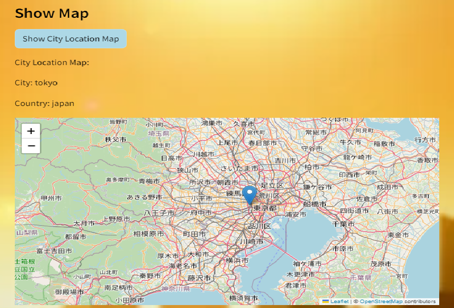

# Weather streamlit Application


Welcome to the Weather Application! This command-line tool allows users to retrieve weather information, set default locations, compare weather conditions, receive alerts, and interact with a chatbot for weather-related queries.

## Overview

The Weather Application provides a range of functionalities to enhance users' experience in accessing weather data efficiently. Here are some key features:

- **Weather Information**: Get current weather conditions for any city around the world.
- **Default Location**: Set a default location for quick access to weather information.
- **Temperature Unit Preference**: Choose between Celsius and Fahrenheit for temperature display.
- **Comparative Analysis**: Compare weather conditions and time between different locations.
- **Alerts**: Receive alerts from Pikud Haoref (Home Front Command) regarding various incidents.
- **Map Visualization**: View a map showing the default location.
- **Chatbot Interaction**: Interact with a chatbot to inquire about weather conditions.

## Installation

1. Clone the repository:

    ```bash
    git clone https://github.com/yourusername/weather-app.git
    ```

2. Install dependencies:

    ```bash
    pip install -r requirements.txt
    ```

3. Run the application:

    ```bash
    python main.py
    ```

## Usage

### Setting Default Location


## CLI Commands

- **Setting Temperature Unit**
```python
python main.py set-temperature-unit --unit "Celsius/Fahrenheit"
```


- **Comparing Weather and Time**
```python
python main.py compare-weather-and-time --city "CityName" --country "CountryName" --timezone "Timezone"
```


- **Talking to Chatbot**
```python
python main.py talk-to-chatbot --user-input "Your question 
```


- **Pikud Haoref Alerts**
```python
python main.py pikud-haoref-alerts 
```


- **Showing Map**
```python
python main.py show-map
```
